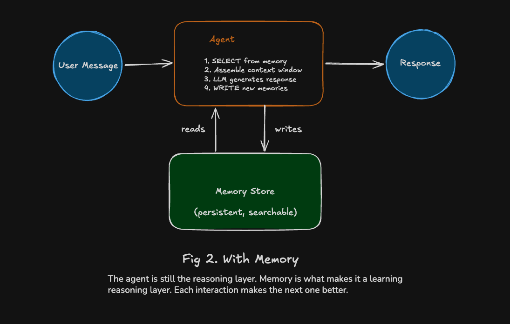

# Personal Finance Coach

**Engineering Context Quality by Architecting Agent Memory**

A demo application for the O'Reilly AI Superstream talk demonstrating agent memory engineering using MongoDB Atlas, Voyage AI, and Claude.



## What This Demonstrates

Most AI agents are stateless — every request starts from zero. This demo shows how to build a **learning agent** that:

- **Writes** structured memory units from conversations
- **Selects** relevant memories via hybrid search (vector + text)
- **Injects** memories into the context window for personalized responses

The result: an agent that remembers user preferences, tracks spending patterns, and identifies mismatches between what users say they care about and how they actually spend.

## Key Concepts

### Three Memory Types

| Type | Collection | Purpose | Example |
|------|------------|---------|---------|
| **Semantic** | `preferences` | User-stated priorities | "User prioritizes dining and travel" |
| **Episodic** | `snapshots` | Computed from data | "February spending: $890 dining, $1,245 car payments" |
| **Working** | `flags` | Agent-inferred insights (expires via TTL) | "Car payments crowd out travel budget" |

### Three Moves

1. **WRITE** — Agent extracts structured memory units from conversation
2. **SELECT** — Hybrid search finds relevant memories (deterministic at session start, query-driven per message)
3. **INJECT** — Selected memories formatted and inserted into the system prompt

### Hybrid Search with $rankFusion

```
User Query
    │
    ├── Voyage AI embed ──→ $vectorSearch (semantic)  ──┐
    │                                                    │
    │                                                    ├──→ $rankFusion ──→ Top memories
    └── raw text ─────────→ $search (full-text)        ──┘
```

Both pipelines run in parallel with pre-filters scoped to the user's active memories.

## Architecture

```
┌─────────────────────────────────────────────────────────────┐
│                        Streamlit UI                          │
│  ┌─────────────────────┐    ┌─────────────────────────────┐ │
│  │     Chat Panel      │    │    Memory Engineering Panel │ │
│  │                     │    │  ┌─────┬────┬───────┬─────┐ │ │
│  │  User ←→ Agent      │    │  │ Doc │Search│Context│Data│ │ │
│  │                     │    │  └─────┴────┴───────┴─────┘ │ │
│  └─────────────────────┘    └─────────────────────────────┘ │
└─────────────────────────────────────────────────────────────┘
                              │
                    ┌─────────┴─────────┐
                    ▼                   ▼
            ┌───────────────┐   ┌───────────────┐
            │  Agent Core   │   │ Direct Queries│
            │               │   │ (sidebar tabs)│
            │ load_baseline │   │               │
            │ select_memories│  │ No LLM needed │
            │ generate_response│               │
            │ write_memories │  │               │
            └───────┬───────┘   └───────┬───────┘
                    │                   │
        ┌───────────┼───────────────────┤
        ▼           ▼                   ▼
┌─────────────┐ ┌─────────────┐ ┌─────────────┐
│ Voyage AI   │ │   Claude    │ │MongoDB Atlas│
│ (embeddings)│ │ (reasoning) │ │  (storage)  │
└─────────────┘ └─────────────┘ └─────────────┘
```

## Prerequisites

- Python 3.12+
- MongoDB Atlas account (free tier M0 works)
- Voyage AI API key
- Anthropic API key (Claude)

## Quick Start

### 1. Clone and setup environment

```bash
git clone https://github.com/your-repo/memory-oreilly-superstream.git
cd memory-oreilly-superstream

python -m venv .venv
source .venv/bin/activate
pip install -r requirements.txt
```

### 2. Configure environment variables

```bash
cp .env.example .env
```

Edit `.env` with your credentials:

```
MONGODB_URI=mongodb+srv://<user>:<pass>@<cluster>.mongodb.net/
MONGODB_DATABASE=finance_coach_db
VOYAGE_API_KEY=vo-...
ANTHROPIC_API_KEY=sk-ant-...
```

### 3. Create Atlas Search indexes

In MongoDB Atlas, create two indexes on the `preferences`, `snapshots`, and `flags` collections:

**Vector Index** (`memory_vector_index`):
```json
{
  "type": "vectorSearch",
  "fields": [{
    "type": "vector",
    "path": "embedding",
    "numDimensions": 1024,
    "similarity": "cosine"
  }]
}
```

**Text Index** (`memory_text_index`):
```json
{
  "mappings": {
    "dynamic": false,
    "fields": {
      "subject": { "type": "string" },
      "fact": { "type": "string" }
    }
  }
}
```

### 4. Seed the database

```bash
make setup
```

This creates:
- 51 transactions for demo user "alex_demo"
- 1 pre-computed spending snapshot
- TTL index for flag expiration

### 5. Run the app

```bash
make run
```

Open http://localhost:8501

## Demo Flow

The app demonstrates memory engineering through 5 messages:

| # | Message | What Happens |
|---|---------|--------------|
| 1 | "I love dining out and traveling. I don't care about clothes or cars." | **WRITE**: Creates preference memories |
| 2 | "What's my dining priority?" | **SELECT**: Text-boosted search finds specific match |
| 3 | "Where am I wasting money?" | **SELECT**: Vector search handles abstract query |
| 4 | "How am I doing this month?" | **WRITE**: Creates flag for spending mismatch |
| 5 | "What should I do about the car payments?" | Agent references its own flag memory |

### Cold Start vs Warm Start

- **New user**: No memories exist. Agent gives generic responses. Memories form in real-time.
- **Returning user (alex_demo)**: Snapshot and preferences loaded at session start. Personalized from the first message.

## Project Structure

```
├── app.py                      # Streamlit entry point
├── src/
│   ├── config.py               # Environment variables, constants
│   ├── db.py                   # MongoDB connection
│   ├── embeddings.py           # Voyage AI integration
│   ├── agent/
│   │   ├── load_baseline.py    # Deterministic SELECT (session start)
│   │   ├── select_memories.py  # Query-driven SELECT (per request)
│   │   ├── generate_response.py# INJECT + Claude call
│   │   ├── write_memories.py   # WRITE — memory extraction
│   │   └── memory_formatter.py # Format memories for context
│   ├── models/
│   │   └── memory.py           # Pydantic models
│   └── prompts/
│       ├── system.py           # System prompt template
│       └── extraction.py       # Memory extraction prompt
├── ui/
│   ├── chat.py                 # Chat interface
│   ├── sidebar.py              # Memory engineering panel
│   ├── tabs/                   # Four sidebar tabs
│   └── components/             # Reusable UI components
├── scripts/
│   ├── seed_data.py            # Seed transactions + snapshot
│   ├── setup_indexes.py        # Create TTL index
│   └── reset_demo.py           # Reset between demo runs
└── docs/                       # Reference documentation
```

## Key Files

| File | Purpose |
|------|---------|
| `src/agent/select_memories.py` | Hybrid search with `$rankFusion` |
| `src/agent/write_memories.py` | Memory extraction from conversation |
| `src/prompts/system.py` | System prompt with memory injection |
| `src/prompts/extraction.py` | Prompt for extracting memory units |
| `ui/tabs/data_tab.py` | Plotly charts for spending visualization |

## Technology Stack

| Component | Technology | Purpose |
|-----------|------------|---------|
| Database | MongoDB Atlas | Memory storage, hybrid search, TTL |
| Embeddings | Voyage AI (`voyage-3-large`) | 1024-dim vectors, asymmetric input types |
| LLM | Claude Sonnet 4 | Response generation + memory extraction |
| UI | Streamlit | Interactive demo interface |
| Charts | Plotly | Spending visualizations |

## Makefile Commands

```bash
make setup    # Create indexes + seed data
make run      # Start the Streamlit app
make reset    # Reset to pre-loaded state
make seed     # Seed data only
make test     # Run pytest
make lint     # Run ruff check
make format   # Run ruff format
```

## Documentation

- `docs/oreilly-talk-concepts.md` — Framework, terminology, architecture
- `docs/oreilly-talk-app-spec.md` — Schemas, prompts, UI spec
- `docs/implementation-plan.md` — Build steps with checkpoints
- `docs/technical-reference.md` — Code-ready specs
- `CLAUDE.md` — Instructions for Claude Code

## Key Takeaways

1. **Memory engineering makes context engineering compound over time.** Without memory, every session starts from zero.

2. **Agent memory is a data modeling problem.** Design schemas for what the agent remembers: `fact` (LLM reads) + `structured_data` (app reads) + provenance.

3. **Hybrid search selects the right memories.** Vector + keyword via `$rankFusion` in one database call.

4. **The agent is an author, not just a reader.** The `store_memory` tool call is the fundamental difference between retrieval and learning.

## References

- [What Is Agent Memory?](https://mongodb.com/resources/basics/artificial-intelligence/agent-memory) — MongoDB's guide
- [Memory in the Age of AI Agents](https://arxiv.org/abs/2512.13564) — Hu et al., Dec 2025
- [Context Engineering for Agents](https://blog.langchain.com/context-engineering-for-agents) — LangChain
- [Effective Context Engineering](https://anthropic.com/engineering/effective-context-engineering-for-ai-agents) — Anthropic

## License

MIT
